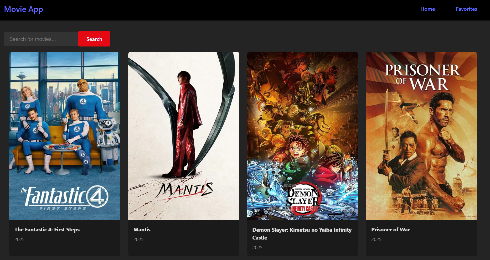
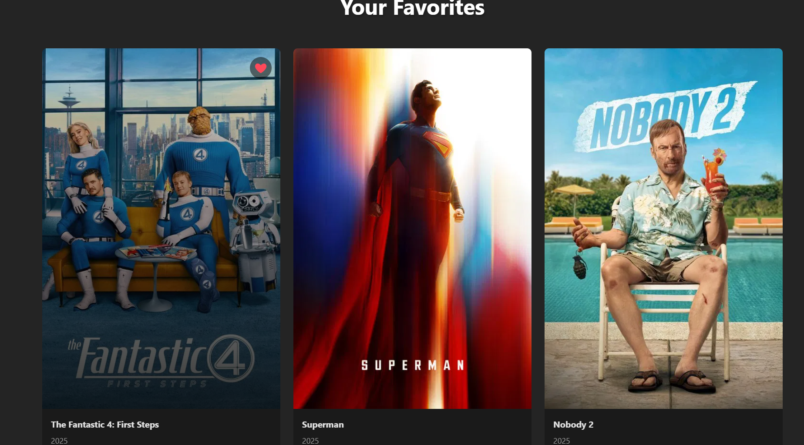

# Movie Search Engine 

A lightweight React + Vite application for searching movie information, using a public movie API.  
This project allows users to search for movies and explore movie data in an intuitive UI.

---

## Table of Contents
- [Features](#features)
- [Demo / Screenshots](#demo--screenshots)  

---

## Features

- Search for movies by title, keyword, or partial matching  
- Display movie details 
- Responsive user interface  
- Error handling and feedback (e.g. when no results found)  
- Built with **React** + **Vite** for a fast development experience

---

## Demo / Screenshots
### Home Page

### Favorites Page

